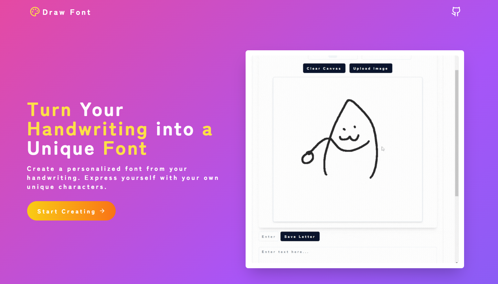

# Awesome DrawFont

DrawFont is an OSS project that allows handwritten fonts to be loaded and used in various projects.
As long as you have a DrawFont file in JSON format, you can load and use that font anywhere.

Website: https://drawfont.com

Github: https://github.com/monicavrx/drawfont

## Viewer

- [example1](https://example.com) - Describe what the example is

## Editor

- [example1](https://example.com) - Describe what the example is

## SDK

- [example1](https://example.com) - Describe what the example is